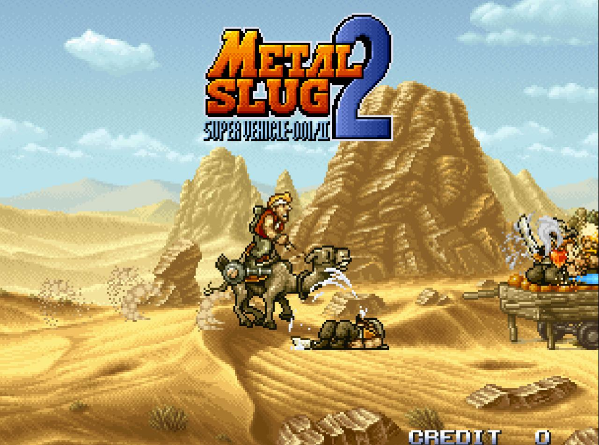

# Vue EmulatorJS - Retro Gaming Platform

[](https://tailtq.github.io/arcade-games)
[](LICENSE)
[](https://vuejs.org/)
[](https://emulatorjs.org)

A modern web-based retro gaming platform that brings classic arcade and console games to your browser. Built with Vue.js and powered by EmulatorJS, this platform supports dozens of gaming systems from the golden age of gaming.



## 🎮 Live Demo

**[Play Now on GitHub Pages →](https://tailtq.github.io/arcade-games)**

## ✨ Features

- 🌐 **Browser-Based**: No downloads or installations required
- 🎯 **Multi-System Support**: 30+ retro gaming systems supported
- 💾 **Save States**: Save and load your progress anywhere
- 🖥️ **Fullscreen Gaming**: Immersive fullscreen experience
- ⌨️ **Customizable Controls**: Remap controls to your preference
- 📱 **Mobile Friendly**: Touch controls for mobile devices
- 🚀 **Fast Loading**: Optimized WebAssembly cores
- 🎨 **Modern UI**: Clean, responsive interface

## 🎲 Supported Systems

### Arcade Systems
- **FBNeo** - Final Burn Neo (CPS1, CPS2, Neo Geo)
- **MAME 2003/2003+** - Multiple Arcade Machine Emulator

## 🚀 Quick Start


## 🎮 Controls

### Default Keyboard Mapping

| Action | Player 1 | Player 2 |
|--------|----------|----------|
| **Movement** | Arrow Keys | WASD |
| **A Button** | Z | T |
| **B Button** | X | Y |
| **C Button** | A | U |
| **D Button** | S | I |
| **Start** | Enter | P |
| **Select** | Shift | O |

### Emulator Shortcuts

| Key | Action |
|-----|--------|
| **F1** | Show/Hide Controls |
| **F2** | Save State |
| **F4** | Load State |
| **F9** | Toggle Fullscreen |
| **F12** | Take Screenshot |

## 📁 Project Structure

```
arcade-games/
├── _config.yml              # Jekyll configuration
├── index.html               # Main game interface
├── README.md                # This file
├── package.json             # Node.js dependencies
├── server.py                # FastAPI development server
├── emulator-config.js       # Game configuration
├── data/                    # EmulatorJS core files
│   ├── cores/              # WebAssembly emulator cores
│   ├── compression/        # Archive utilities
│   └── localization/       # Language files
├── roms/                   # ROM files directory
│   └── mame-roms/         # Organized by system
├── _layouts/               # Jekyll layouts
├── _includes/              # Jekyll includes
└── assets/                 # Static assets
    ├── css/               # Stylesheets
    ├── js/                # JavaScript files
    └── images/            # Images and icons
```

## ⚙️ Configuration

### Adding New Games

1. **Add ROM file** to appropriate directory in `roms/`
2. **Update game configuration** in `emulator-config.js`:

```javascript
this.gameConfigs = {
    'your-game': {
        name: 'Your Game Title',
        romFile: 'your-game.zip',
        core: 'appropriate-core',
        system: 'system-name',
        color: '#hexcolor',
        description: 'Game description'
    }
};
```

3. **Create game page** (optional) in `_games/your-game.md`
4. **Update navigation** if needed

### Customizing the Site

Edit `_config.yml` to customize:
- Site title and description
- Author information
- Social links
- Navigation menu
- Supported systems


## 🔧 API Reference

### FastAPI Endpoints (Development)

- `GET /` - Main game interface
- `GET /data/*` - EmulatorJS static files
- `GET /roms/*` - ROM file serving

### JavaScript API

## 📄 Legal Notice

**Important**: This project is for educational and preservation purposes. Users must own legal copies of any ROM files used. The maintainers do not provide or distribute copyrighted content.

## 🤝 Contributing

We welcome contributions! Here's how to help:

1. **Fork** the repository
2. **Create** a feature branch (`git checkout -b feature/amazing-feature`)
3. **Commit** your changes (`git commit -m 'Add amazing feature'`)
4. **Push** to the branch (`git push origin feature/amazing-feature`)
5. **Open** a Pull Request

### Areas for Contribution
- New emulator cores
- UI/UX improvements
- Mobile optimization
- Performance enhancements
- Documentation
- Game compatibility testing

## 📊 Performance Tips

### Optimal Performance
- Use **Chrome or Firefox** for best performance
- Enable **hardware acceleration** in browser settings
- Close **unnecessary tabs** and applications
- Use **appropriate emulator cores** for your system
- Consider **lower resolution** for older hardware

### Troubleshooting
- **Game won't load**: Check ROM format and core compatibility
- **Poor performance**: Try different emulator core or lower settings
- **Controls not working**: Click game area to focus, check F1 for mappings
- **Audio issues**: Check browser audio permissions and settings

## 📈 Roadmap

- [ ] **Multiplayer support** - Online multiplayer gaming
- [ ] **Achievement system** - Track gaming milestones
- [ ] **Game library** - Browse and organize ROM collection
- [ ] **Mobile app** - Native mobile applications
- [ ] **Cloud saves** - Sync save states across devices
- [ ] **Streaming** - Share gameplay with others

## 🙏 Acknowledgments

- **[EmulatorJS](https://emulatorjs.org)** - Core emulation library
- **[RetroArch](https://www.retroarch.com)** - Emulator cores and libretro
- **[Vue.js](https://vuejs.org)** - Progressive JavaScript framework
- **[Jekyll](https://jekyllrb.com)** - Static site generator
- **[GitHub Pages](https://pages.github.com)** - Free hosting platform

## 📞 Support

- **Issues**: [GitHub Issues](https://github.com/tailtq/arcade-games/issues)
- **Discussions**: [GitHub Discussions](https://github.com/tailtq/arcade-games/discussions)
- **Documentation**: [Wiki](https://github.com/tailtq/arcade-games/wiki)

---

**Made with ❤️ for retro gaming enthusiasts**

*Relive the golden age of gaming in your browser!*